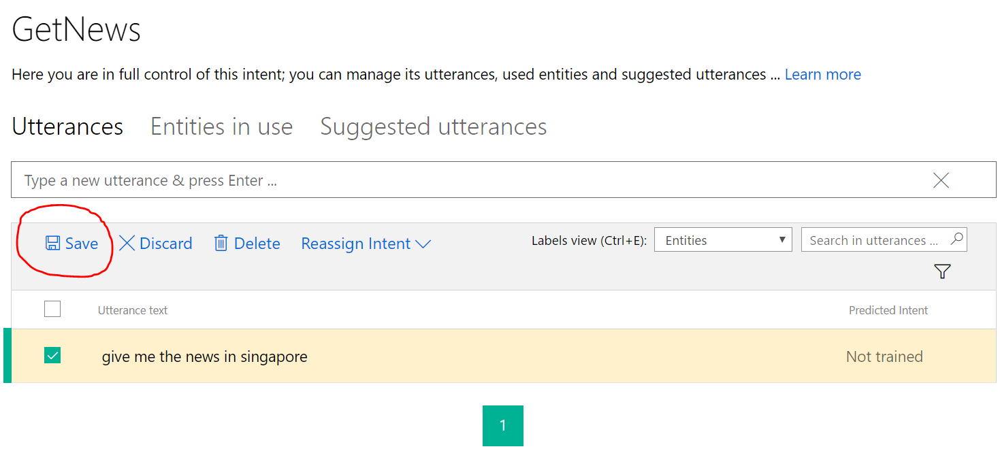
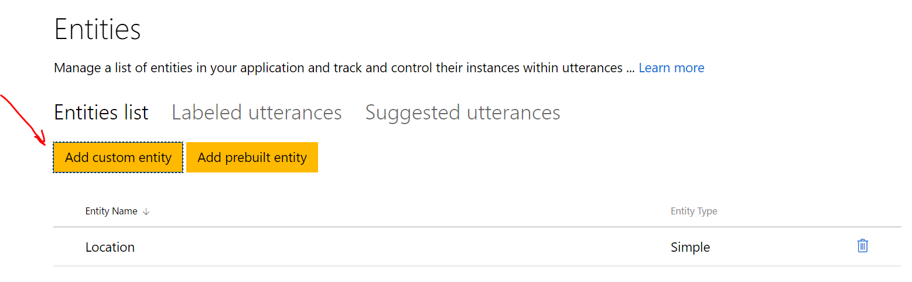
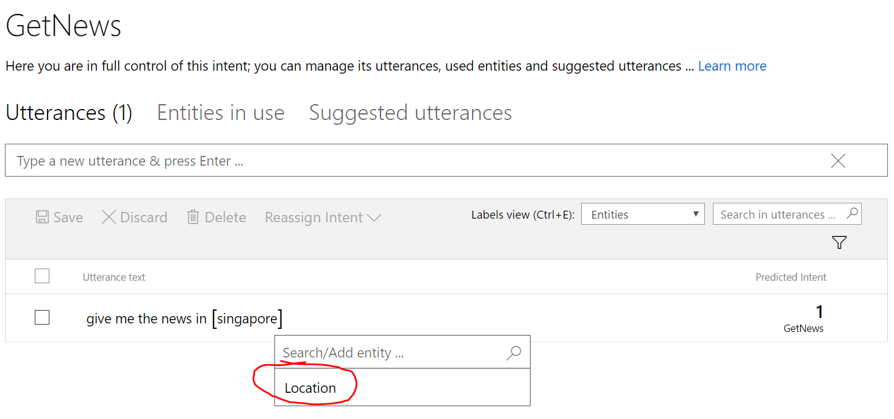
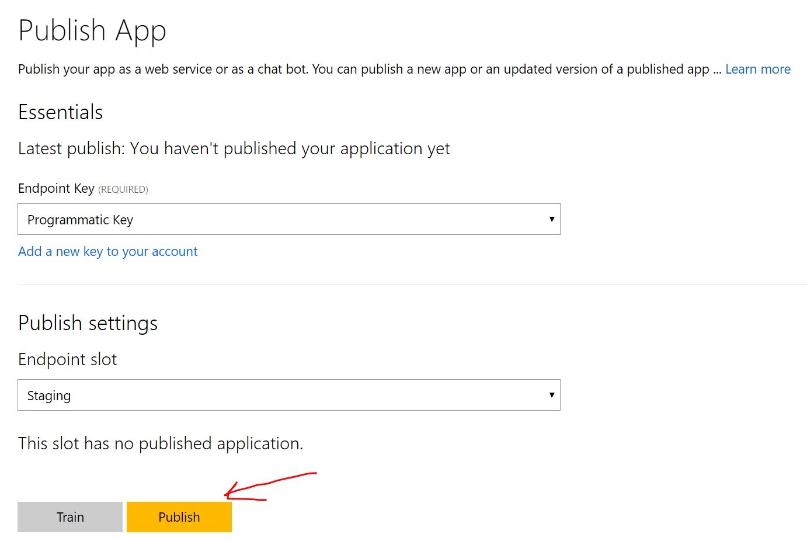

# Language Understanding Intelligent Service (LUIS)

## Natural Language
Bots often do not just take binary inputs. Users rarely type in the exact way you want them to, which often makes direct string comparison difficult. The solution is to use LUIS.AI to understand natural language.

## Intents and Entities
LUIS allows us to detect what the user wants based on the sentence they send, which is often known as an "intent". Sometimes we want to parse the actionable information within the sentence, which is often known as "entities". We can then execute logic or send back messages depending on the intent and entities in the sentence.

For example, let's say a user says _What's the news in **Paris** on **Thursday**?_. Using LUIS, we can tell that the intent is to "GetNews" while the entities are location ("Paris") and date ("Thursday"). This allows the program to know that the user wants to find news at the location and date specified.

## Activating LUIS
First, login to [LUIS.AI](https://www.luis.ai) using your personal Microsoft account or work/school account. 

Go to the `My Keys` tab. 

There are 2 types of keys:

**Programmatic API Key**: Created automatically per LUIS account and you don't have to buy it. It enables you to author and edit your application using LUIS programmatic APIs.

**Endpoint Key(s)**: You need to buy it from Microsoft Azure portal. It is essential for publishing your app and accessing your HTTP endpoint. This key reflects your quota of endpoint hits based on the usage plan you specified while creating the key.

In order to use your Programmatic API key as an endpoint (this key can be used for 1000 query hits/month by the way):

1. Go to the my keys page.
2. Copy the Programmatic API key that you have.
3. Click on the **Add a new key** button on the **Endpoint Keys** tab and paste the key you copied in the Key Value input field. You can also, optionally, name your key something human readable.  If it's a programmatic key, think about labeling it "Programmatic key" to remember.

## Making a new LUIS app
Go back to the [LUIS.AI](https://www.luis.ai) page and click on "My apps" in the navi.  To begin creating a new app, first:

1.  Click on **New app**
2.  Fill in the form (picking your newly added key as the endpoint key)
3.  Hit **Create**

### Making a new intent

The default intent is "None", which will be used whenever no intent is detected from a user's sentence.  Let's add an intent.

1.  Click on **Create an intent** 
2.  Click on **Add intent**
3.  Give it a good name - in our case we will name it "GetNews"
4.  Type an example "utterance" like _Give me the news in Singapore_ and hit enter to add it.
5.  Click on "Save" to save this example.



### Making a new entity

1.  Click on **Entities**
2.  Click on **Add custom** and give it the name "Location", keeping the entity type "Simple"



## More utterances
In order for LUIS to perform better, you need to give it more examples of an intent.  Usually we need a minimum of 5 per entity per intent.

Let's add another utterance saying "Can I get the news in London".  Go ahead and add a few more.  You can try off the wall ones like "I'm from Mars" to see how well it does labeling as None.

1.  On the **Intents** page, click the intent name "GetNews" to open its details page, with **Utterances** as the current tab.
2.  Label the utterance from above (_Give me the news in Singapore_) by clicking on "Singapore" and selecting "Location" from the drop-down.

3.  Add a new utterance like _Can I get the news in London_ and _I'd like the news report for New York City_
4.  Label the locations as "Location" (you may need to highlight all words to move the bracket to expand over cities with multiple words)
5.  Add a few more including off-the-wall ones like "I'm from Mars" to see how well it's getting the intent.
6.  Press **Save**

## Train

1.  Click on **Train & Test**
2.  Click on **Train Application** and this will train on the new data or utterances that you just labeled.

## Publishing LUIS

1. If you aren't in the app yet, go to the app you want to publish and try by clicking on the My Apps link in the top navigation.
5. Go the **Publish App** page of the app. Choose the key name/value that you just created in the drop down of keys at the top of the page under the **Essentials** segment.
6. Click **Publish** to publish this as an http endpoint.



You are good to go!  The endpoint url is generated and you can click on it to test it in a browser, or, we recommend you use the our **Train & Test** page for a friendlier experience of testing your endpoint (Enable the endpoint checkbox on the test and train page).

After publishing, a URL will be provided to you. Copy and take note of this URL.

## Updating LUIS

Whenever we add new intents, entities or utterances, LUIS has to be updated. We can do this by clicking **Train & Test** and **Train Application** again, then going to **Publish App** to publish once more.  Then our new data will be reflected in our model that can be reached through the http endpoint url.

Good job, you now have a LUIS model specific for gettin the news from a geographical location.

## Connecting LUIS to your bot
Connecting LUIS to your bot is as simple as pasting the publish URL into the intent dialog you already have.

```js
var luisRecognizer = new builder.LuisRecognizer('Your publish URL here');
var intentDialog = new builder.IntentDialog({recognizers: [luisRecognizer]});
bot.dialog('/', intentDialog);
```

After that, your bot will be able to understand natural language.
