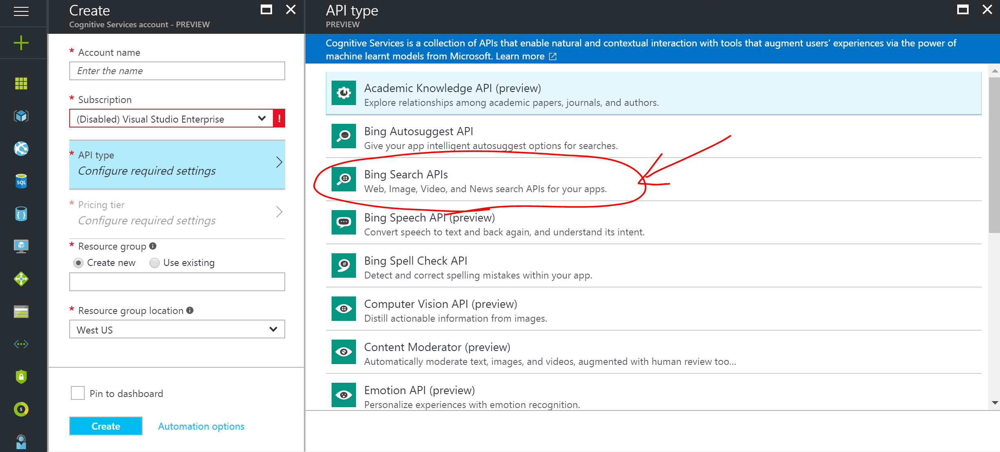

# Mission 2: Building the bot and getting news

The bot we made in Mission 1 currently doesn't do much. In this part, we'll be building out the logic of our bot and enabling it to retrieve news from Earth, so that we can keep up to date with current affairs.

## Natural Language

Before starting on this tutorial, we first need to make our bot understand natural language. Follow this [tutorial](LUIS.MD) to make your bot work with LUIS.

## Mission

We're moving on to more complex stuff now. Let's try fetching news based on category so we can stay updated with civilisation.


**So what are we using to get the news?**

We're gonna go to CNN and copy paste the headlines manually into our bot. Just kidding. We'll be using the [Bing News API](https://www.microsoft.com/cognitive-services/en-us/bing-news-search-api). We can use it to get top news by categories, search the news, and get trending topics. I highly suggest briefly looking through the following links to familiarise yourself with the API:

- [Endpoints and examples of requests and responses](https://msdn.microsoft.com/en-us/library/dn760783.aspx)
- [Parameters for requests](https://msdn.microsoft.com/en-us/library/dn760793(v=bsynd.50).aspx)
- [Market Codes for Bing](https://msdn.microsoft.com/en-us/library/dn783426.aspx)
- [Categories for Bing News by market](https://msdn.microsoft.com/en-us/library/dn760793(v=bsynd.50).aspx#categoriesbymarket)

To start using the Bing News API, we will need a subscription key. We can get one in a similar manner as how we got our LUIS subscription key. Go to the [Azure portal](https://portal.azure.com) and log in. Then click + New and search for Cognitive Services. Create a new Cognitive Services API instance, and make sure you select Bing Search APIs in the API type field. 



Now that you have your subscription key (you can use either key 1 or key 2, it doesn't matter), you can go to the [API testing console](https://dev.cognitive.microsoft.com/docs/services/56b43f72cf5ff8098cef380a/operations/56f02400dbe2d91900c68553) and play around with the API if you'd like. Try sending some requests and see the responses you get. [Here](https://msdn.microsoft.com/en-us/library/dn760793(v=bsynd.50).aspx#categoriesbymarket) are all the possible categories for Category News by the way. 


**Ok cool, now how do we link the news to the bot?**

Let's start off by getting the bot to understand us when we try to look for news or scan an image. Make sure your intentsDialog.matches line looks like below.

Also, don't forget about your LUIS recognizer and bot root dialog from the LUIS tutorial. 

```js
intentDialog.matches(/\b(hi|hello|hey|howdy)\b/i, '/sayHi') //Check for greetings using regex
    .matches('GetNews', '/topNews') //Check for LUIS intent to get news
    .matches('AnalyseImage', '/analyseImage') //Check for LUIS intent to analyze image
    .onDefault(builder.DialogAction.send("Sorry, I didn't understand what you said.")); //Default message if all checks fail
```

Also, let's be friendly and add a 'sayHi' dialog for when we detect the greetings regex as follows:

```js
bot.dialog('/sayHi', function(session) {
    session.send('Hi there!  Try saying things like "Get news in Toyko"');
    session.endDialog();
});
```

Go ahead and run your bot code from the command line as you have been with `node index.js`.

Basically, when the user's utterance comes in to the bot, it gets checked against the regex first. If none of the regexes match, it will make a call to LUIS and route the message to the intent that it matches to. Add this snippet of code at the end to create a dialog for top news:

```js
bot.dialog('/topNews', [
    function (session){
        // Ask the user which category they would like
        // Choices are separated by |
        builder.Prompts.choice(session, "Which category would you like?", "Technology|Science|Sports|Business|Entertainment|Politics|Health|World|(quit)");
    }, function (session, results){
        var userResponse = results.response.entity;
        session.endDialog("You selected: " + userResponse);
    }
]);
```

Try using natural language to ask your bot for news - it should work perf :) Notice that if you ask it to analyse an image it's gonna crash. That's because we haven't written out any dialogs called '/analyseImage' yet.

**Not 1... But 2 functions in a dialog!?**

Yup. It's natural for a dialog to go back and forth, and so BotBuilder allows us the flexibility to have dialogs with multiple steps. This is called a [Waterfall](https://docs.botframework.com/en-us/node/builder/chat/dialogs/#waterfall). In this case, we use a [Prompt](https://docs.botframework.com/en-us/node/builder/chat/prompts) to present some choices to the user. Once the user selects a choice, we advance to the next step of the waterfall. The user's response from the previous step is also passed on. Run it and give it a go.

Let's go ahead and change the logic in the second step of the waterfall. Modify '/topNews' to the following:

```js
bot.dialog('/topNews', [
    function (session){
        // Ask the user which category they would like
        // Choices are separated by |
        builder.Prompts.choice(session, "Which category would you like?", "Technology|Science|Sports|Business|Entertainment|Politics|Health|World|(quit)");
    }, function (session, results){
        if (results.response && results.response.entity !== '(quit)') {
            //Show user that we're processing their request by sending the typing indicator
            session.sendTyping();
            // Build the url we'll be calling to get top news
            var url = "https://api.cognitive.microsoft.com/bing/v5.0/news/?" 
                + "category=" + results.response.entity + "&count=10&mkt=en-US&originalImg=true";
            session.endDialog("Url built.");
        } else {
            session.endDialog("Ok. Mission Aborted.");
        }
    }
]);
```

Here, we've handled if the user decides to quit the prompt. In terms of the url's parameters, we've only used a few parameters, but you can see a list of all parameters [here](https://msdn.microsoft.com/en-us/library/dn760793(v=bsynd.50).aspx#Anchor_2). Here is a brief explanation of the paramters we've used:

- **category** = the category we want news about.
- **count** = the number of news articles we want the API to return. I highly recommend returning 10 as 10 is the maximum number of cards that Messenger allows you to display at once.
- **mkt** = the language/country we want news from (only UK and US available at the moment).
- **originalImg** = whether we want the API to return the original image url with the article. I highly recommend setting this to true, otherwise the API returns thumbnails instead which translates to very low image quality.

**How do we make the actual API call?**

Not with a cellphone. We'll be using a Node package called [request-promise](https://www.npmjs.com/package/request-promise). Have a read of their [documentation](https://github.com/request/request-promise) and see how it is used to make API calls. Install the package by running the following command into the command prompt:

```shell
npm install --save request-promise
```

Now let's add a reference to request-promise into our bot. Add it to the top where we reference other modules such that all of the references look like this:

```js
var restify = require('restify');
var builder = require('botbuilder');
var rp = require('request-promise');
```

Under that, let's declare the Bing Search Subscription Key which we will need to add in the header of the request:

```js
...
// Static variables that we can use anywhere in server.js
var BINGSEARCHKEY = '*****YOUR SUBSCRIPTION KEY GOES HERE*****';
...
```

Note that for security reasons it's generally not advisable to paste any keys, passwords or sensitive stuff in your code - for now we're just doing it for the sake of simplicity. You can use [environment variables](https://blogs.msdn.microsoft.com/stuartleeks/2015/08/10/azure-api-apps-configuration-with-environment-variables/) as a way to keep the sensitive stuff away from the code. But for now just put it in your code. 

With that, we can start calling the API. Modify '/topNews' to the following:

```js
bot.dialog('/topnews', [
    function (session){
        // Ask the user which category they would like
        // Choices are separated by |
        builder.Prompts.choice(session, "Which category would you like?", "Technology|Science|Sports|Business|Entertainment|Politics|Health|World|(quit)");
    }, function (session, results, next){
        // The user chose a category
        if (results.response && results.response.entity !== '(quit)') {
           //Show user that we're processing their request by sending the typing indicator
            session.sendTyping();
            // Build the url we'll be calling to get top news
            var url = "https://api.cognitive.microsoft.com/bing/v5.0/news/?" 
                + "category=" + results.response.entity + "&count=10&mkt=en-US&originalImg=true";
            // Build options for the request
            var options = {
                uri: url,
                headers: {
                    'Ocp-Apim-Subscription-Key': BINGSEARCHKEY
                },
                json: true // Returns the response in json
            }
            //Make the call
            rp(options).then(function (body){
                // The request is successful
                console.log(body); // Prints the body out to the console in json format
                session.send("Managed to get your news.");
            }).catch(function (err){
                // An error occurred and the request failed
                console.log(err.message);
                session.send("Argh, something went wrong. :( Try again?");
            }).finally(function () {
                // This is executed at the end, regardless of whether the request is successful or not
                session.endDialog();
            });
        } else {
            // The user choses to quit
            session.endDialog("Ok. Mission Aborted.");
        }
    }
]);
```

If you run the bot now and choose a category, the API call is made and if you look at the command prompt, you should see the body of the response being printed. Have a look at it, and you'll find that all the articles are returned in the 'value' property of the body object. Let's now write a function that returns all the articles as a bunch of cards to the user. Add this function right below the topNews dialog - we'll call this function sendTopNews.

```js
bot.dialog('/topNews', [
    ...
]);
// This function processes the results from the API call to category news and sends it as cards
function sendTopNews(session, results, body){
    session.send("Top news in " + results.response.entity + ": ");
    //Show user that we're processing by sending the typing indicator
    session.sendTyping();
    // The value property in body contains an array of all the returned articles
    var allArticles = body.value;
    var cards = [];
    // Iterate through all 10 articles returned by the API
    for (var i = 0; i < 10; i++){
        var article = allArticles[i];
        // Create a card for the article and add it to the list of cards we want to send
        cards.push(new builder.HeroCard(session)
            .title(article.name)
            .subtitle(article.datePublished)
            .images([
                //handle if thumbnail is empty
                builder.CardImage.create(session, article.image.contentUrl)
            ])
            .buttons([
                // Pressing this button opens a url to the actual article
                builder.CardAction.openUrl(session, article.url, "Full article")
            ]));
    }
    var msg = new builder.Message(session)
        .textFormat(builder.TextFormat.xml)
        .attachmentLayout(builder.AttachmentLayout.carousel)
        .attachments(cards);
    session.send(msg);
}
```

We only invoke this function when the API call is successful. Modify the part in the '/topNews' dialog where the request is being made to the following:

```js
bot.dialog('/topNews', [

    ...

    //Make the call
    rp(options).then(function (body){
        // The request is successful
        sendTopNews(session, results, body);
    }).catch(function (err){
        // An error occurred and the request failed
        console.log(err.message);
        session.send("Argh, something went wrong. :( Try again?");
    }).finally(function () {
        // This is executed at the end, regardless of whether the request is successful or not
        session.endDialog();
    });

    ...

]);
```

Lastly, let's update package.json to indicate that our starting script is app.js. Go to package.json and modify the scripts property to this:

```js
{
    ...
    "scripts": {
        "start": "node index.js"
    }
    ...
}
```

You have now successfully fetched news from civilization! Microsoft Bot Framework makes it easy to deploy your bot onto any platform, but you need to be aware that not all messaging platforms (e.g. Kik, Telegram) will support the same attachments (e.g. most of them support sending text and image messages, but not cards). While the logic is the same (i.e. the API calls you make will not change across the bots), you'd have to check which messaging platform the user's message is coming from, then handling how your response is sent based on that. I may do a tutorial for this in future. 

