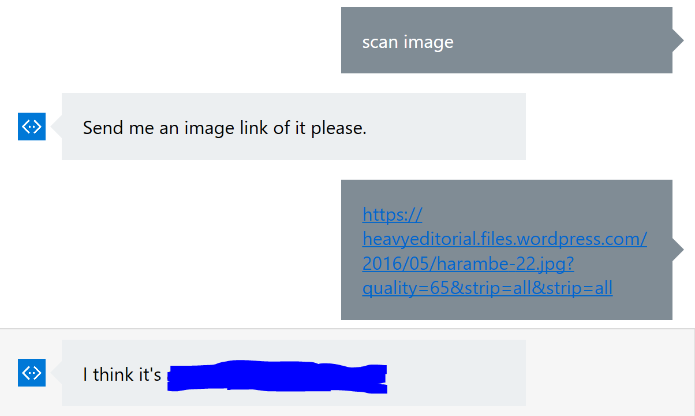

#Mission 3: Identifying an image using the Computer Vision API

The goal of the mission is to be able to let the bot know you want to scan an image. The bot then takes in a url, sends it to the CV API, and gets the caption.

The completed conversation if you complete this mission should look like this:



- You'll need the Bing Computer Vision API. [Here's](https://dev.projectoxford.ai/docs/services/56f91f2d778daf23d8ec6739/operations/56f91f2e778daf14a499e1fe) the API reference. Refer to it when building your options for the API call in your code. Retrieving the subscription keys is similar to how you did it for LUIS and the news search. 

The options for your API call should be in the following format:

```js
var options = {
            method: 'POST', // thie API call is a post request
            uri: '**REFER TO API REFERENCE AND FIND OUT THE API ENDPOINT**',
            headers: {
                'Ocp-Apim-Subscription-Key': '**YOUR BING COMPUTER VISION KEY**',
                'Content-Type': '**REFER TO API REFERENCE**'
            },
            body: {
                url: '**THE IMAGE URL PROVIDED BY THE USER**'
            },
            json: true
        }
```

Here's a simple dialog that asks the user for an image link.

```js
bot.dialog('/analyseImage', [
    function (session){
        builder.Prompts.text(session, "Send me an image link of it please.");
    },
    function (session,results){
        var inputUrl = results.response;
    }
]);
```

Next, we generate the options object for the request, using the user's URL.

```js
bot.dialog('/analyseImage', [
    function (session){
        builder.Prompts.text(session, "Send me an image link of it please.");
    },
    function (session,results){
        //Options for the request
        var options = {
            method: 'POST',
            uri: 'https://api.projectoxford.ai/vision/v1.0/describe?maxCandidates=1',
            headers: {
                'Ocp-Apim-Subscription-Key': BINGCVKEY,
                'Content-Type': 'application/json'
            },
            body: {
                //https://heavyeditorial.files.wordpress.com/2016/05/harambe-22.jpg?quality=65&strip=all&strip=all
                url: results.response
            },
            json: true
        }
    }
]);
```

Then, we can send the request using the options object we generated.

```js
bot.dialog('/analyseImage', [
    function (session){
        builder.Prompts.text(session, "Send me an image link of it please.");
    },
    function (session,results){
        //Options for the request
        var options = {
            method: 'POST',
            uri: 'https://api.projectoxford.ai/vision/v1.0/describe?maxCandidates=1',
            headers: {
                'Ocp-Apim-Subscription-Key': BINGCVKEY,
                'Content-Type': 'application/json'
            },
            body: {
                //https://heavyeditorial.files.wordpress.com/2016/05/harambe-22.jpg?quality=65&strip=all&strip=all
                url: results.response
            },
            json: true
        }
        //Make the request
        rp(options).then(function (body){
            // Send the caption
            session.send("I think it's " + body.description.captions[0].text)
        }).catch(function (err){
            console.log(err.message);
            session.send(prompts.msgError);
        }).finally(function () {
            session.endDialog();
        });
    }
]);
```

####Once you think you've got it, put the following image links into your bot:
- http://cp91279.biography.com/1000509261001/1000509261001_2051017826001_Bio-Biography-Neil-Armstrong-SF.jpg
- http://cdn1us.denofgeek.com/sites/denofgeekus/files/styles/article_width/public/2016/01/millennium-falcon.jpg
- https://heavyeditorial.files.wordpress.com/2016/05/harambe-22.jpg

**Let us know what the captions for each 3 are. No cheating! We will be reviewing your code and potentially asking questions.**